# flutter_syntax_view

Flutter Syntax Highlighter

## Usage

```dart
  String code = """
// Importing core libraries
import 'dart:math';
int fibonacci(int n) {
  if (n == 0 || n == 1) return n;
  return fibonacci(n - 1) + fibonacci(n - 2);
}          
var result = fibonacci(20);
/* and there 
    you have it! */
""";
  SyntaxView(
        code: code,
        syntax: Syntax.DART,
        syntaxTheme: SyntaxTheme.dracula(),
        withZoom: true,
        withLinesCount: true
      );
```

## Supported Syntax

- [x] Dart
- [x] C
- [x] C++
- [x] Java
- [x] Kotlin
- [x] Swift
- [x] JavaScript
- [x] YAML
- More will be added.

## Themes

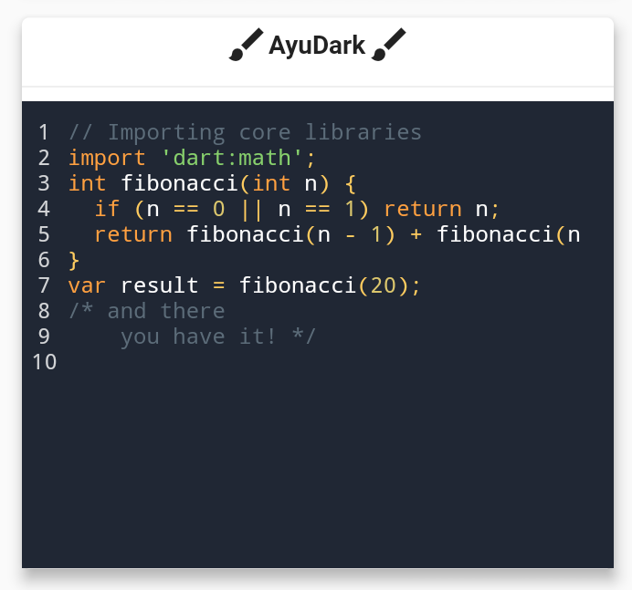 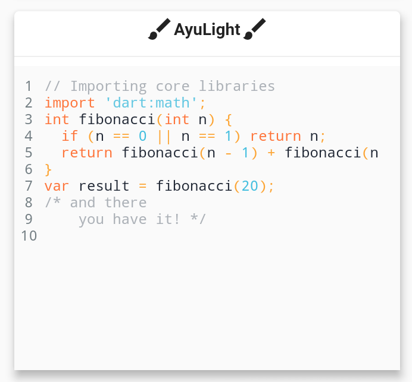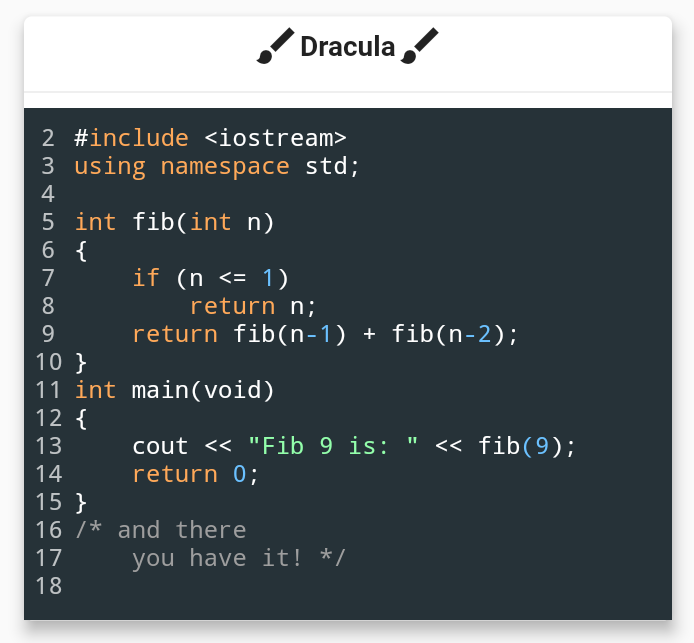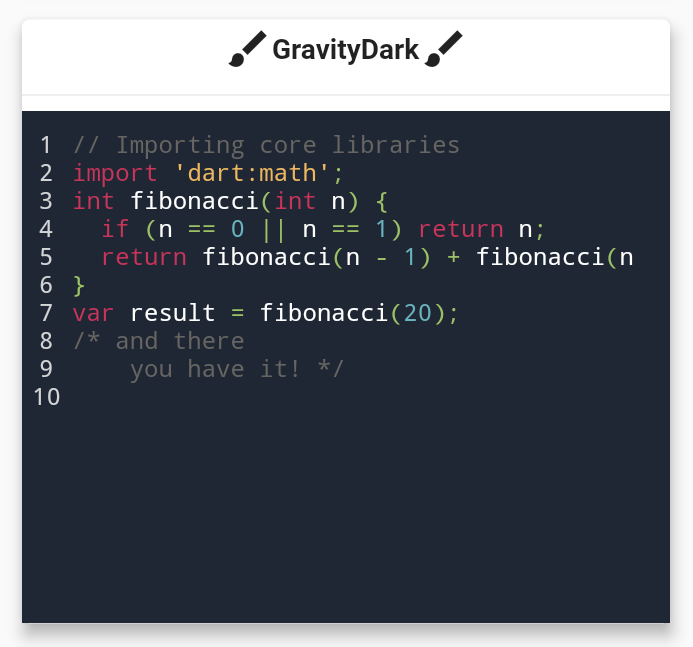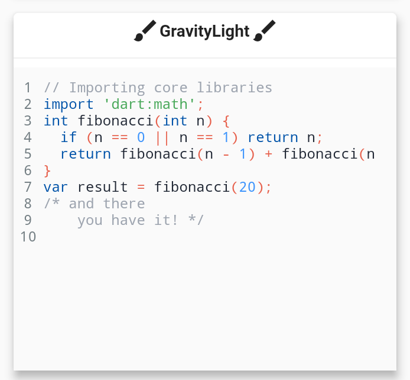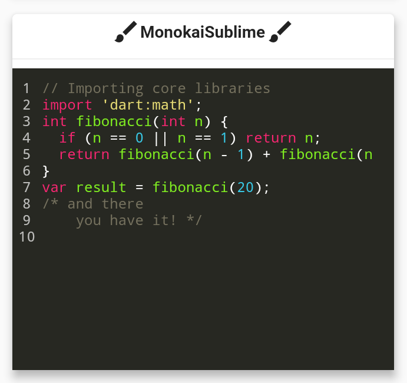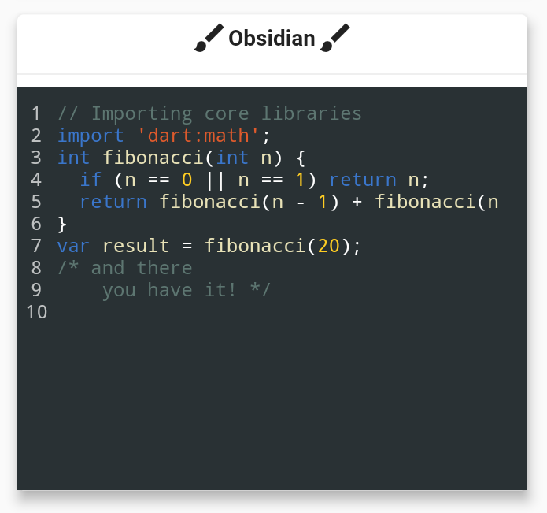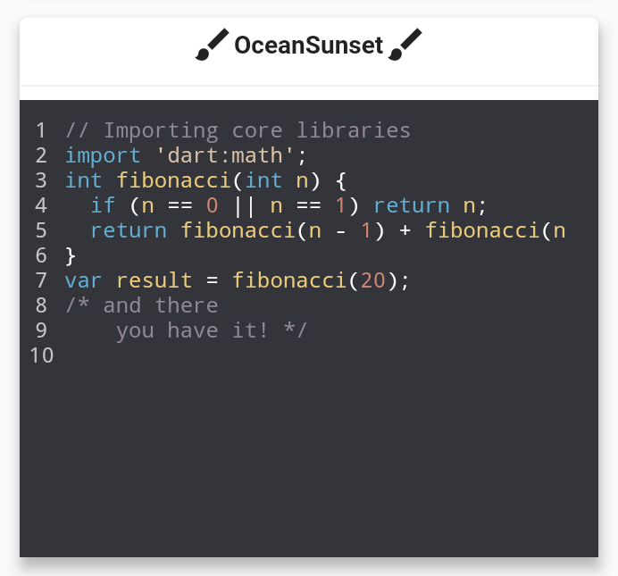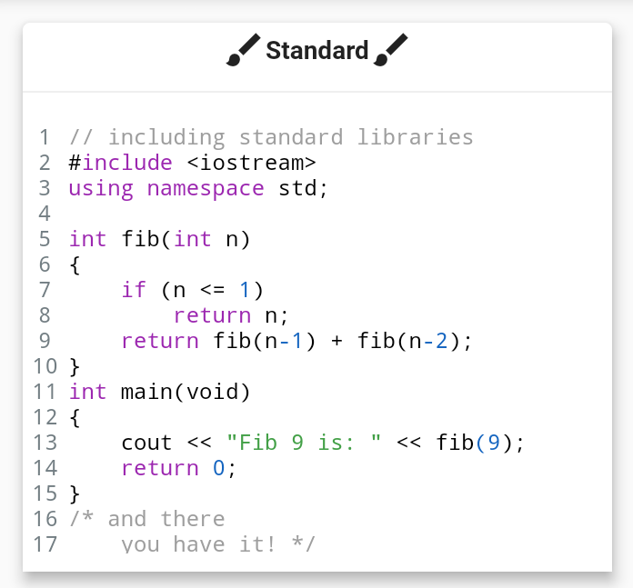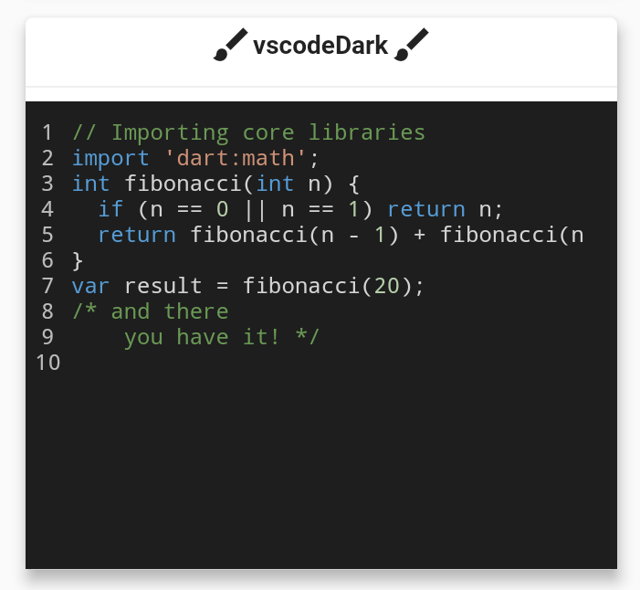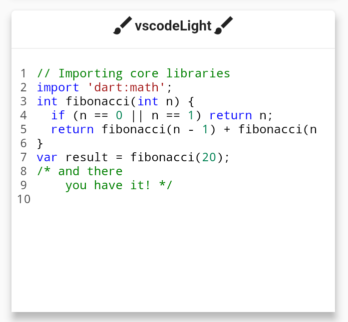


## Installing

[Package](https://pub.dartlang.org/packages/flutter_syntax_view)


## TODO

- [ ] Add More Syntax Support.
- [ ] Add More Themes.


## Contributing

- if you are familiar with Regular Expressions in Dart and would like contribute in adding further syntax support. it will be very appreciated!


## Contributors ✨
Thanks goes to these wonderful people!<br>
<table>
  <tr>
    <a href="https://github.com/rodydavis">
      
    </a>
  </tr>
  <tr>
    <a href="https://github.com/LuodiJackShen">
      
    </a>
  </tr>
  <tr>
    <a href="https://github.com/luodijack">
      
    </a>
  </tr>
  <tr>
    <a href="https://github.com/marwenx">
      
    </a>
  </tr>
</table>


## Features and bugs

If you face any problems feel free to open an issue at the [issue tracker][tracker]. If you feel the library is missing a feature, please raise a ticket on Github. Pull request are also welcome.

[tracker]: https://github.com/BaderEddineOuaich/flutter_syntax_view/issues